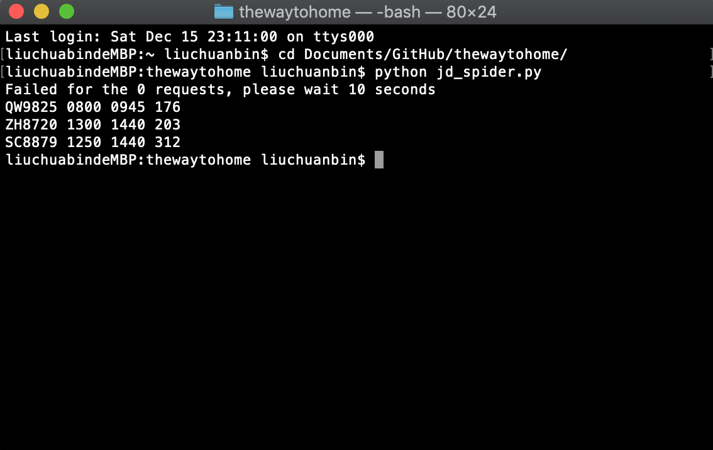
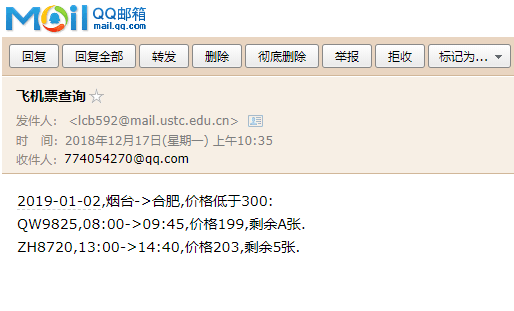

# thewaytohome

一个帮助你找到回家机票的软件

* [x] 京东
* [ ] 去哪
* [ ] 携程
* [ ] 途牛


## jd_spider.py

监视[京东旅行-机票](https://jipiao.jd.com/)

**使用方法**

将代码中 payload 结构体中的 depCity、arrCity、depDate、arrDate 修改为你的需要。例如：

```shell
    payload = {'depCity': '烟台', 'arrCity': '合肥', 'depDate': '2019-01-02', 'arrDate': '2019-01-02', 'queryModule': '1',
               'lineType': 'OW', 'queryType': 'jipiaoindexquery'}
```

监视2019年1月2号从烟台到合肥的机票。

**使用效果**
依次显示 航班号 发出时间 到达时间 最低价格


## mailapp.py

使用科大邮件系统发送邮件通知

## main.py

主程序
**使用方法**
在代码中指定你的出发地，目的地，时间，票价。每隔一定时间查询一次（不要太频繁，否则会被翻爬虫盯上）。

```shell
    depcity = '烟台'
    arrcity = '合肥'
    date = '2019-01-02'
    price = 300
```

**使用效果**
执行代码，命令行依次显示航班号，起飞时间，落地时间，机票价格，剩余数量（A表示余票充足）。

```shell
liuchuanbindeMacBook-Pro:thewaytohome liuchuanbin$ python main.py --pw 你的密码
Requests sucess!
2018.12.17-10:35:23
2019-01-02,烟台->合肥,价格低于300:
QW9825,08:00->09:45,价格199,剩余A张.
ZH8720,13:00->14:40,价格203,剩余5张.
```

同时这些信息将通过邮箱发送给你。


## 修改记录

    20181216
        添加监视京东机票程序。
    20181217
        添加邮箱app和主调用程序。
---

如有其他疑问联系本人：liuchuanbin1992@gmail.com
